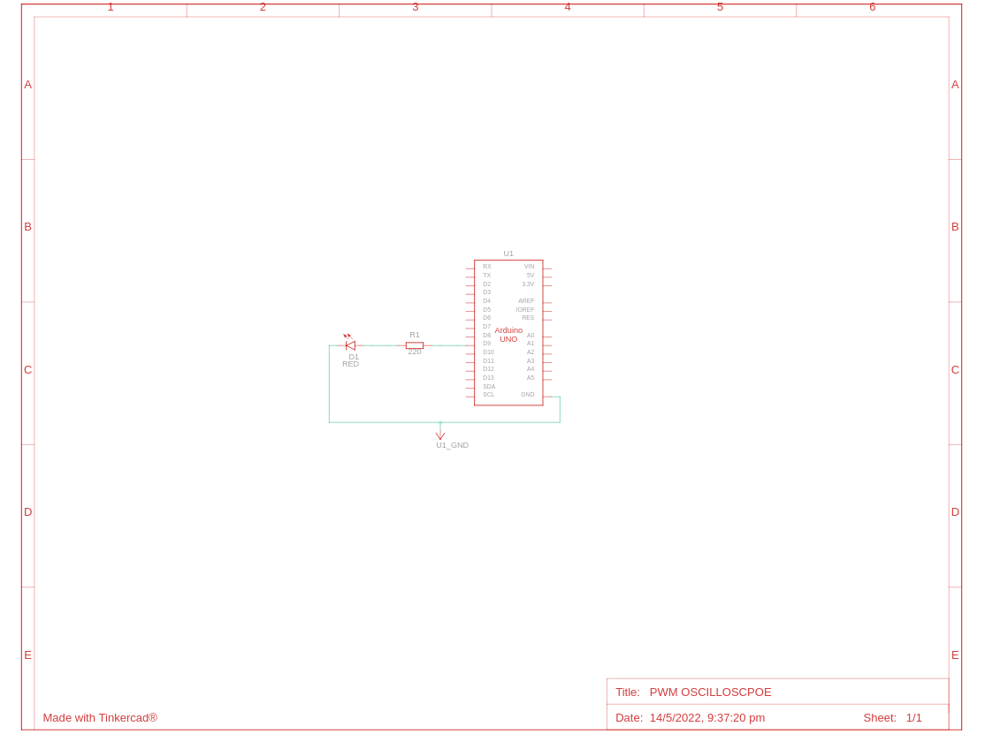
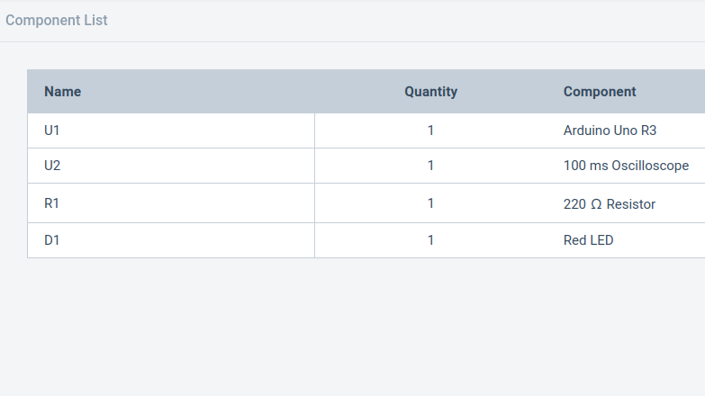

### Pulse With Modulation(PWM)
Pulse width modulation (PWM) is a modulation technique that generates variable-width pulses to represent the amplitude of an analog input signal. The output switching transistor is on more of the time for a high-amplitude signal and off more of the time for a low-amplitude signal.
### Circuit Connections
### TinkerCAD Implementation

